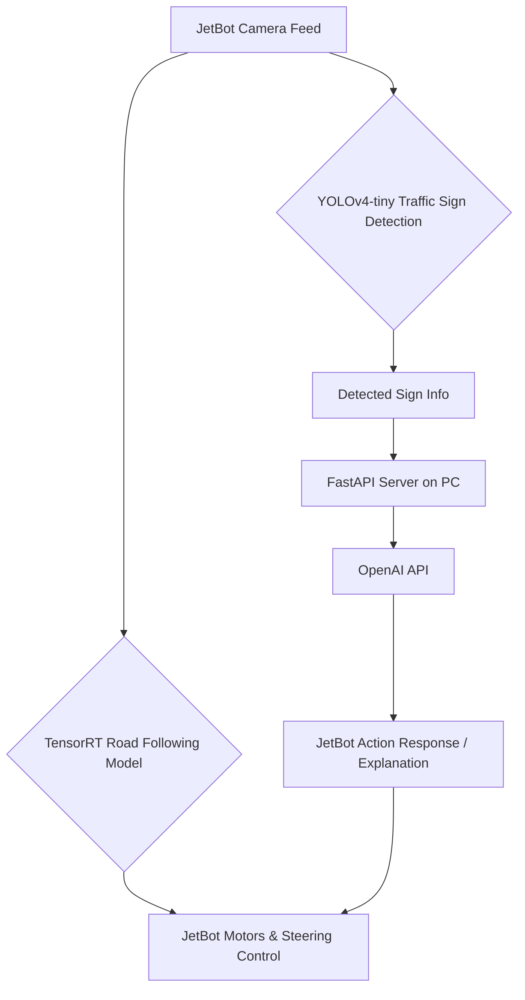

# JetBot-AI-Traffic-Interaction-System
  
This project presents an integrated intelligent autonomous driving system based on the NVIDIA JetBot platform. The system performs road following, real-time traffic sign recognition, and semantic interaction through an external FastAPI server connected to the OpenAI API. By combining vision-based navigation, object detection, and natural language reasoning, the system mimics simplified human decision-making behavior in a controlled traffic environment.
  
---

## System Overview
  
The final implementation integrates three components originally developed as separate course projects:
  
| Module | Description |
|--------|-------------|  
| **Road Following (Navigation)** | Controls steering and movement through a TensorRT-optimized ResNet18-based model for continuous lane/track following. |  
| **Traffic Sign Recognition** | Detects six categories of traffic signs using a YOLOv4-tiny model optimized for embedded execution. |  
| **AI Semantic Interaction** | Sends detected sign information to a FastAPI server on a local PC, where OpenAI interprets the scene and returns a contextual response. |  
  
---

## Demo Video

This demonstration shows the JetBot performing real-time road following, traffic sign recognition, and OpenAI-based semantic interaction.

[](https://youtu.be/Eqr76V0940g)

*(Click the image to view on YouTube)*

---

## Recognized Traffic Signs
  
| Class Index | Traffic Sign | Meaning (Behavior Applied) |  
|------------|-------------|----------------------------|  
| 0 | block | Stop / Do not proceed |  
| 1 | max60 | Slow down |  
| 2 | min30 | Speed up |  
| 3 | pedestrian | Pedestrian crossing caution |  
| 4 | railway | Stop and wait before crossing |  
| 5 | stop | Full stop before proceeding |  
  
---  

## System Data Flow  


---

## Key Features

- Real-time embedded vision-based navigation
- Multi-threaded processing allows simultaneous driving + detection
- Traffic signs dynamically influence speed and motion behavior
- OpenAI provides contextual, human-understandable explanations
- Modular design — each model can be retrained or replaced independently

---

## Project Structure

```bash
JetBot-AI-Traffic-Interaction-System/
├── detected_img/               # Output directory for detected signs
├── final/
│   └── final.ipynb             # Main execution notebook
├── server/
│   └── server.py               # FastAPI server script (Runs on PC)
├── standard_sign/              # Reference sign images for OpenAI prompt
├── models/                     # Placeholder: Insert model files here
├── utils/                      # YOLO helper utilities (must be included)
├── README.md  
└── requirements.txt            # Python environment dependencies                  
```

## Model Files

Model weight files are **not included** in this repository due to size and platform constraints.

Please download the required TensorRT models from the link below:

🔗 **Model Download (Google Drive Folder)**  
https://drive.google.com/drive/folders/1tsehiFhHNQYlPO1pisj3IlyrLNrO-eTO
  
---

## Hardware & Software Environment

- NVIDIA Jetson Nano / JetBot platform  
- Python 3.6+  
- TensorRT + PyCUDA optimization  
- YOLOv4-tiny traffic sign model  
- FastAPI server running on PC  
- OpenAI API for semantic interpretation  

---

## Execution Notes

1. Place trained models in `/models/`  
2. Start FastAPI server on PC  
3. Connect JetBot and PC to the same network  
4. Run `final.ipynb` to begin road following and sign detection  

---

## Acknowledgements  

This project was developed as part of an embedded systems curriculum focused on AI-driven autonomous navigation and human-interactive robotics.  
